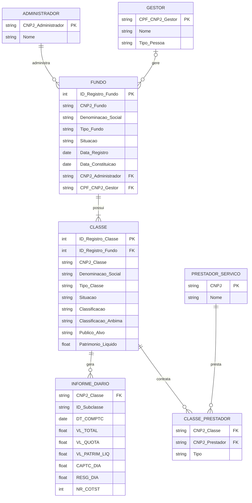

# Modelo ER — Fundos de Investimento (CVM)

```mermaid
erDiagram
    FUNDO {
        int ID_Registro_Fundo PK
        string CNPJ_Fundo
        string Denominacao_Social
        string Tipo_Fundo
        string Situacao
        date Data_Registro
        date Data_Constituicao
        string CNPJ_Administrador FK
        string CPF_CNPJ_Gestor FK
    }
    ADMINISTRADOR {
        string CNPJ_Administrador PK
        string Nome
    }
    GESTOR {
        string CPF_CNPJ_Gestor PK
        string Nome
        string Tipo_Pessoa
    }
    CLASSE {
        int ID_Registro_Classe PK
        int ID_Registro_Fundo FK
        string CNPJ_Classe
        string Denominacao_Social
        string Tipo_Classe
        string Situacao
        string Classificacao
        string Classificacao_Anbima
        string Publico_Alvo
        float Patrimonio_Liquido
    }
    PRESTADOR_SERVICO {
        string CNPJ PK
        string Nome
    }
    CLASSE_PRESTADOR {
        string CNPJ_Classe FK
        string CNPJ_Prestador FK
        string Tipo
    }
    INFORME_DIARIO {
        string CNPJ_Classe FK
        string ID_Subclasse
        date DT_COMPTC
        float VL_TOTAL
        float VL_QUOTA
        float VL_PATRIM_LIQ
        float CAPTC_DIA
        float RESG_DIA
        int NR_COTST
    }

    ADMINISTRADOR ||--o{ FUNDO : "administra"
    GESTOR |o--o{ FUNDO : "gere"
    FUNDO ||--|{ CLASSE : "possui"
    CLASSE ||--o{ INFORME_DIARIO : "gera"
    CLASSE ||--o{ CLASSE_PRESTADOR : "contrata"
    PRESTADOR_SERVICO ||--o{ CLASSE_PRESTADOR : "presta"
```